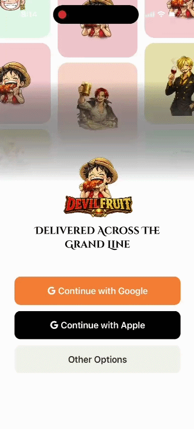

# Food Delivery App UI — React Native Navigation Assignment

## Assignment Task

Build a Food Delivery App UI in React Native using Expo.

The goal of this assignment is to practice major React Navigation patterns in one complete app. The main focus is navigation structure, nested navigators, params, auth flow, deep linking, and smooth screen movement.

### Requirements

- Expo React Native project setup
- Onboarding screen with a Get Started button
- Stack Navigator flow: Onboarding → Home → Restaurant Detail → Cart
- Pass restaurant name and price from Home to Restaurant Detail using params
- Custom stack header with title, back label, and header color
- Bottom Tab Navigator with Home, Search, Orders, and Profile
- Vector icons for all tabs
- Badge on Orders tab when cart is not empty
- Restaurant Stack nested inside Home tab
- Hide bottom tab bar on Restaurant Detail and Cart screens
- Drawer Navigator accessible from Profile
- Drawer items: My Orders, Settings, Help, Logout
- Custom drawer content with user avatar and name
- Conditional auth flow
- Persist mock auth state after app reload
- Screen transition animations
- Programmatic navigation using navigate, goBack, replace, and reset
- Deep link support: `foodapp://restaurant/123`

---

## My Work

## Demo Video

